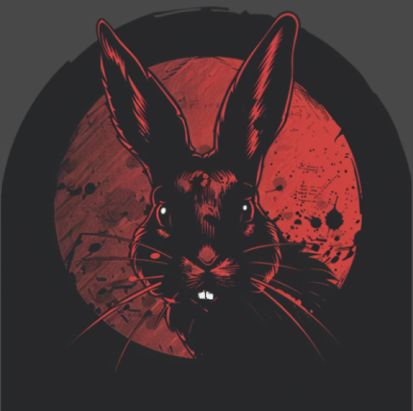

# Patricia Chess Engine

  

  
  [![License][license-badge]][license-link]
  [![Release][release-badge]][release-link]
  [![Commits][commits-badge]][commits-link]
  

A killer bunny who will not hesitate to ram as many pieces as possible down your throat, Patricia is the most aggressive chess engine the world has ever seen.

***

## Download/Play Against Patricia
Binaries for the most recent release of Patricia, as well as instructions on how to build Patricia from source, can be found on the [Releases](https://github.com/Adam-Kulju/Patricia/releases) page.   
Patricia plays on Lichess under two different accounts:   
[Full Strength Patricia](https://lichess.org/@/PatriciaBot)   
[Weakened Patricia for humans to play against](https://lichess.org/@/littlePatricia)   
Several of Patricia's best games can be found at the bottom of [this page](https://www.sp-cc.de/patricia_eas_engine.htm). 

***

## Aggression
The metric that Patricia's aggression claims are based off of is Stefan Pohl's [EAS tool (found here)](https://www.sp-cc.de/eas-ratinglist.htm), which is the most well known and best regarded tool for determining the aggressiveness of chess engines. It looks at a combination of factors, such as sacrifice rate, short win rate, and unnecessary draw rate, and outputs a score that captures how "exciting" an engine tends to play. It's not a perfect statistic but from my experience it reflects the "eye test" well.

The average engine's EAS score generally falls between 50,000 and 100,000. The most aggressive top engine is Stockfish, due to its extreme tactical ability; it has an EAS score of 190,000.

By contrast, Patricia's EAS score is <b><i>430,000</i></b> as tested by [Pohl himself](https://www.sp-cc.de/patricia_eas_engine.htm).

It's worth noting that Patricia is still extremely powerful, clocking in at 3500 on the CCRL Blitz rating list; she can put up a solid fight against top engines, and will crush any humans.

***

## What Patricia currently does to increase aggressiveness
- Default contempt of 30 centipawns for draws deemed avoidable
- Neural network using a custom training/retraining script over multiple filtered data sources that was developed over the course of a few months - this is the main source of Patricia 3's aggressiveness.
- Partially asymmetrical evaluation; Patricia doesn't care if she gets sacrificed against, so all sacrifice bonuses apply to the original side to move only.
- Bonuses for going down in material compared to original position being searched
- Bonuses for being better off than what material would suggest
- Material scaling

***

## Customization Options

Patricia supports a few options for users:

`Hash`: The memory alloted to the transposition table.

`Threads`: Number of threads to search with.

`UCI_LimitStrength`: Enables Patricia to be weakened using `UCI_Elo`.

`UCI_Elo`: Sets Patricia to play at a given strength range, anywhere from 500 to 3000. These ratings were calibrated by playing many matches against engines of all strengths.

`UCI_Chess960`: Enabling this option allows Patricia to play FRC.

`MultiPV`: Patricia searches the best X moves instead of only looking for the best line.

`Skill_Level`: Sets Patricia to play at one of 20 possible strength levels. They are:
| Skill Level | ELO |
|:---:|---|
| 1 | 500 |
| 2 | 800 |
| 3 | 1000 |
| 4 | 1200 |
| 5 | 1300 |
| 6 | 1400 |
| 7 | 1500 |
| 8 | 1600 |
| 9 | 1700 |
| 10 | 1800 |
| 11 | 1900 |
| 12 | 2000 |
| 13 | 2100 |
| 14 | 2200 |
| 15 | 2300 |
| 16 | 2400 |
| 17 | 2500 |
| 18 | 2650 |
| 19 | 2800 |
| 20 | 3000 |

`go nodes`: Search a position for a given number of nodes.

`go depth`: Search a position to a given depth.

`go movetime`: Search a position for a given number of milliseconds.

***

## Evaluation and Filtering
Patricia's evaluation is a pair of neural networks with 768x2->768->1 perspective arches, trained on 2.4 billion positions of my other engine [Willow's](https://github.com/Adam-Kulju/Willow) data. One of them has been additionally retrained on a filtered dataset of 50 million positions specially selected for being "aggressive positions", in order to increase Patricia's understanding of them and to make her more likely to play into similar positions.

For more information on filtering and retraining, consult the [Wiki](https://github.com/Adam-Kulju/Patricia/wiki/Filtering,-converting,-and-retraining).

***

## Datagen

Patricia has support for data generation; in order to compile the datagen script, run `make datagen` in the `engines` directory. This will give you an executable named `data`; run `./data [number of threads] [optional EPD opening book]` to start datagen, and exit the process whenever you want with Ctr-C.

***

## Acknowledgements

- A huge shoutout to Stefan Pohl. His EAS Tool works wonderfully, makes properly and objectively testing for increase aggression possible, and is the measure by which Patricia development progressed. He was also very invested in Patricia's development and explained many features of the EAS tool to me so that I had a better understanding of what was a sacrifice and what wasn't. He has put a lot of time into quantifying style, and I am happy to have Patricia be a proof-of-concept and culmination of his ideas.

- Thanks to my friends at SweHosting as usual, for being supportive, for suggesting ideas, and for spreading Patricia propaganda in the Stockfish Discord server.

- Thanks to all the people interested in an aggressive chess engine. The support I got in my developer log on Talkchess is really nice to see. I'm glad people care about style in chess too, rather than just ELO!

***

## Other

Instructions for downloading/building Patricia can be found in the Releases section. If you know UCI protocol, you can run Patricia directly, otherwise she will work with any major GUI ([Arena](http://www.playwitharena.de/), [BanksiaGUI](https://banksiagui.com/), etc.)

If you think Patricia is a cool project, please spread the word! There are lots of people interested in an aggressive engine, whether it be for sparring or for analysis, and greater awareness of the undisputed queen of style would make their wish come true.

[license-badge]: https://img.shields.io/github/license/Adam-Kulju/Patricia?style=for-the-badge
[release-badge]: https://img.shields.io/github/v/release/Adam-Kulju/Patricia?style=for-the-badge
[commits-badge]: https://img.shields.io/github/commits-since/Adam-Kulju/Patricia/latest?style=for-the-badge

[license-link]: https://github.com/Adam-Kulju/Patricia/blob/main/LICENSE
[release-link]: https://github.com/Adam-Kulju/Patricia/releases/latest
[commits-link]: https://github.com/Adam-Kulju/Patricia/commits/main
